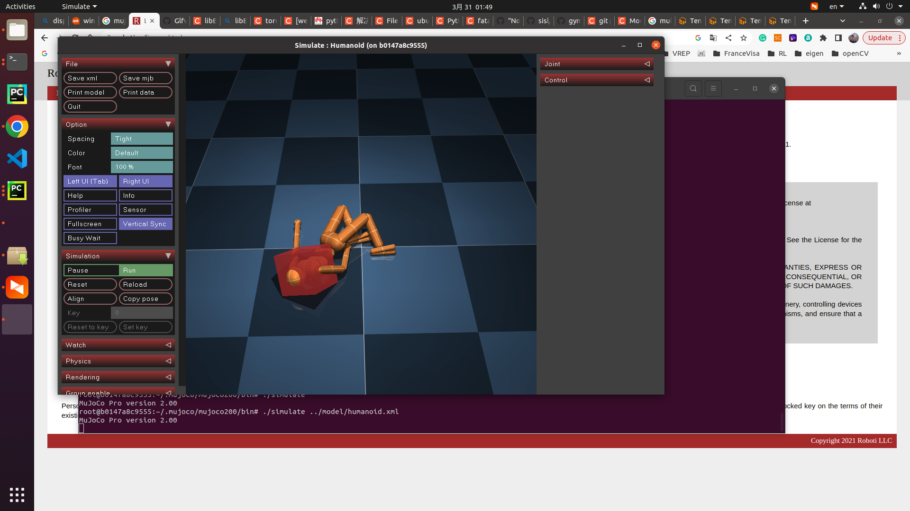

# mujoco-docker
Dockerfile for mujoco200 environment. Visualization via X server.



This is a MuJoCo200 environment with mujoco-py==2.1. The simulator GUI can be visualised via X11 forwarding.

# Usage
## Build Docker Image
```
docker build -t "your image tag" .
```
## Run Containner
```
docker run -it --name mujoco -v docker_ws:/root/docker_ws --gpus=all -v /tmp/.x11-unix:/tmp/.x11-unix -e GDK_SCALE -e GDK_DPI_SCALE -p 5022:22 ef6872bb9f6f /bin/bash
```
## SSH Connect
Restart the containner
```
docker restart mujoco
```
ssh to container
```
ssh root@0.0.0.0 -p 5022
```
The default passwd of container is **123123**.
> Container runs as Xclient, and the hostPC runs as Xserver. SSH config has been already set in container. However, you must set Xserver.

## Run MuJoCo
```
cd /root/.mujoco/mujoco200/bin/
./simulate ../model/humanoid.xml
```
